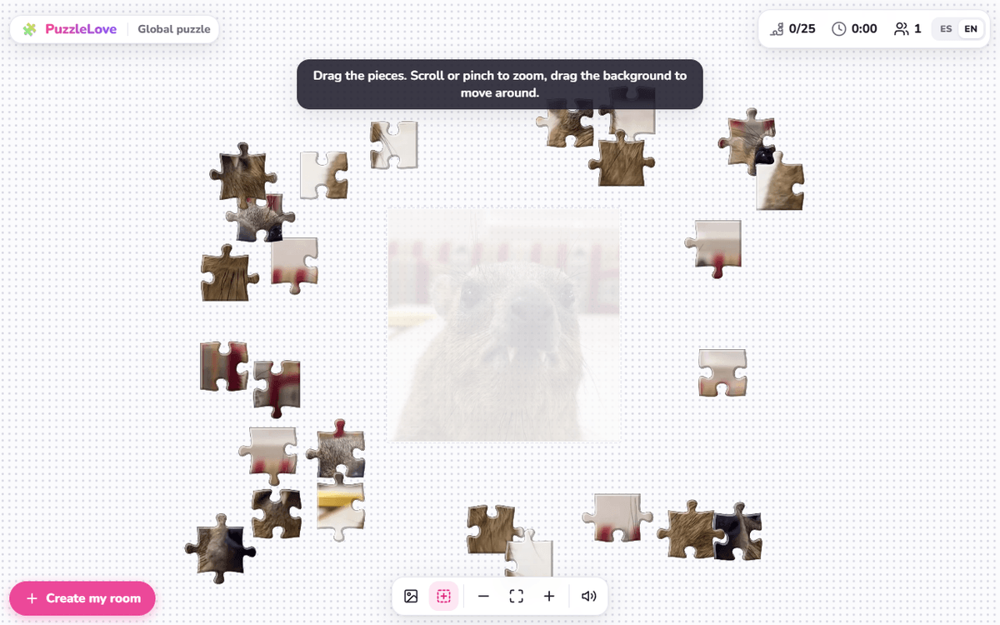
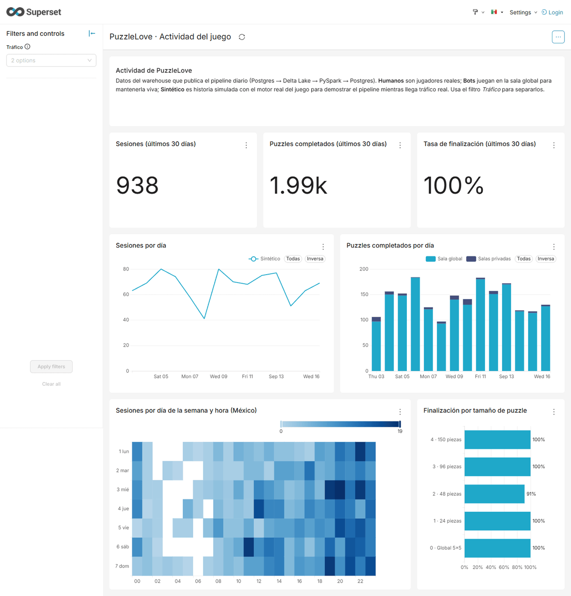
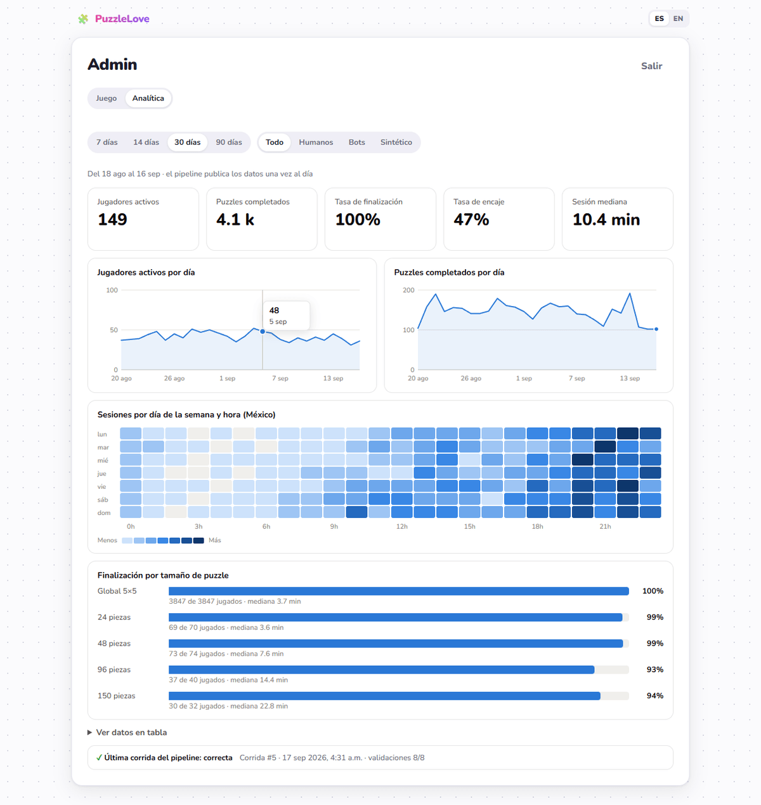
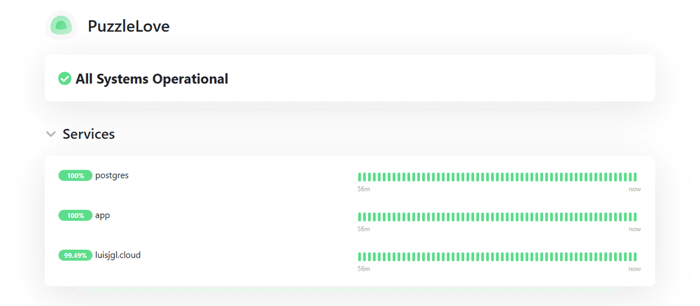
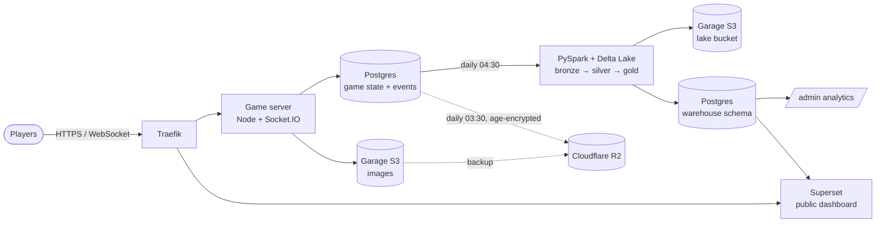

# PuzzleLove 🧩

[](https://github.com/LUISJG57/PuzzleLove/actions/workflows/ci.yml)
[](https://github.com/LUISJG57/PuzzleLove/actions/workflows/deploy.yml)

A real-time multiplayer jigsaw puzzle, plus the production platform and data stack around it — all running on a
single 8 GB VPS.

Upload a photo, it is cut into classic tabbed pieces, and everyone in the room assembles it together on a shared board
with live cursors, piece locking and snapping sounds.

## See it live

| What | Link | Access |
|---|---|---|
| The game | https://luisjgl.cloud | Public |
| Analytics dashboard (Apache Superset) | https://superset.luisjgl.cloud/superset/dashboard/puzzlelove/ | Public, read-only |
| Service status (Uptime Kuma) | https://status.luisjgl.cloud/status/puzzlelove | Public |
| CI/CD runs | https://github.com/LUISJG57/PuzzleLove/actions | Public |
| Container images (GHCR) | https://github.com/LUISJG57?tab=packages&repo_name=PuzzleLove | Public |

## Verify it in 5 minutes

1. **Multiplayer:** open https://luisjgl.cloud in two browser windows (or phone + laptop) with different names. Drag a
   piece in one: the other shows your cursor, locks the piece while you hold it and plays the snap when it connects.
   Bots named "🤖 …" join the global room during active hours.
2. **Private room:** click *Create my room*, upload any photo, pick a size and share the link.
3. **Data pipeline output:** open the Superset dashboard. Every number comes from the nightly PySpark + Delta Lake
   pipeline, not from the game database. Use the *Tráfico* (traffic) filter to separate humans, bots and the
   clearly labeled synthetic history.
4. **Delivery:** open any run of the [Deploy workflow](https://github.com/LUISJG57/PuzzleLove/actions/workflows/deploy.yml):
   tests (Node, PySpark, ansible-lint) → five images → SSH deploy with health check and automatic rollback.
5. **Engineering depth:** read [docs/journey.md](docs/journey.md). It walks through how the platform was built and the
   24 incidents found on the way, with root causes and fixes.

## Screenshots

| | |
|---|---|
| **Game** — global room, shared board, reference silhouette | **Superset** — public dashboard over the warehouse |
|  |  |
| **Admin analytics** — private `/admin` tab (local environment, synthetic data) | **Status page** — Uptime Kuma |
|  |  |

## Where to look in the code

| Claim | Evidence |
|---|---|
| Authoritative real-time multiplayer | [`server/src/rooms/RoomManager.ts`](server/src/rooms/RoomManager.ts), [`shared/src/puzzle/state.ts`](shared/src/puzzle/state.ts), [`server/src/server.test.ts`](server/src/server.test.ts) |
| Event tracking that never blocks the game | [`server/src/analytics/sink.ts`](server/src/analytics/sink.ts), [`sink.test.ts`](server/src/analytics/sink.test.ts) |
| Bronze / silver / gold with Delta Lake | [`analytics/pipeline/`](analytics/pipeline/) — [`bronze.py`](analytics/pipeline/bronze.py), [`silver.py`](analytics/pipeline/silver.py), [`gold.py`](analytics/pipeline/gold.py) |
| Data quality gates and run history | [`analytics/pipeline/quality.py`](analytics/pipeline/quality.py), [`runs.py`](analytics/pipeline/runs.py) |
| Warehouse load with transactional swap | [`analytics/pipeline/load.py`](analytics/pipeline/load.py) |
| Dashboards as code, public access limited to aggregates | [`deploy/superset/bootstrap/dashboards.py`](deploy/superset/bootstrap/dashboards.py) |
| Admin analytics API and charts | [`server/src/analytics/warehouse.ts`](server/src/analytics/warehouse.ts), [`client/src/components/charts.tsx`](client/src/components/charts.tsx) |
| Simulator on the real engine | [`tools/simulator/src/generate.ts`](tools/simulator/src/generate.ts), [`live.ts`](tools/simulator/src/live.ts) |
| CI/CD with rollback | [`.github/workflows/`](.github/workflows/), [`deploy/deploy.sh`](deploy/deploy.sh) |
| Infrastructure as code | [`deploy/docker-compose.prod.yml`](deploy/docker-compose.prod.yml), [`deploy/ansible/`](deploy/ansible/) |
| Encrypted backups and restore drill | [`deploy/backup/backup.sh`](deploy/backup/backup.sh), [`deploy/restore.sh`](deploy/restore.sh) |

## What is private, and why

Some parts are intentionally not public; screenshots and code above show them, and a live walkthrough is available on
request.

| Private part | Why |
|---|---|
| `/admin` (image queue, analytics tab) | Controls the global room |
| Superset editing, SQL Lab, other datasets | The warehouse includes player display names and ids; only aggregates are public |
| Pipeline run history (`warehouse.pipeline_runs`) | Error messages can include internals |
| Traefik dashboard, Uptime Kuma admin, the VPS | Operational access |

## What this project demonstrates

| Area | What was built |
|---|---|
| **Software** | TypeScript monorepo: React + Konva client, Node/Express + Socket.IO authoritative game server, shared deterministic puzzle engine, Prisma/Postgres |
| **Cloud & infrastructure** | Hardened Ubuntu VPS provisioned with Ansible, Docker Compose, Traefik with automatic Let's Encrypt, Garage (S3-compatible object storage), firewall layering |
| **CI/CD** | GitHub Actions: tests → five images to GHCR → SSH deploy with migrations, health checks and automatic rollback |
| **Operations** | Daily age-encrypted backups to Cloudflare R2 with tested restores, Uptime Kuma + UptimeRobot alerting to Discord |
| **Data engineering** | Gameplay event tracking → incremental extract → **Delta Lake** bronze/silver/gold with **PySpark** → data quality gates → Postgres star-schema warehouse |
| **Analytics** | In-app admin dashboard (hand-built SVG charts) and a public Apache Superset dashboard defined as code |
| **Testing** | 42 automated tests (engine, server integration, simulator, PySpark transforms), Ansible idempotency test, lint in CI |

## Architecture at a glance



## Documentation

| Document | Contents |
|---|---|
| [docs/architecture.md](docs/architecture.md) | System design: components, networks, data model, pipeline, security, operations, limitations |
| [docs/adr/](docs/adr/) | Architecture decision records: why each major choice was made and what it costs |
| [docs/journey.md](docs/journey.md) | How the platform was built step by step, every incident and bug found along the way, and lessons learned |
| [docs/runbook.md](docs/runbook.md) | Day-2 operations: deploy, rollback, backups and restores, pipeline, Superset, Ansible |

## Repository layout

```
shared/            Deterministic puzzle engine (piece shapes, snapping, events) used by client and server
server/            Express 5 + Socket.IO game server, Prisma schema and migrations, analytics event sink
client/            React 19 + Vite + Konva board, i18n (es/en), admin + analytics dashboard
tools/simulator/   Live bots and a synthetic-history generator built on the real engine
analytics/         PySpark + Delta Lake pipeline, data quality checks, warehouse loader (Python, uv, pytest)
deploy/            Compose stack, Traefik, Garage, backups, Superset, deploy/restore scripts, Ansible
.github/workflows/ CI (tests, PySpark tests, ansible-lint) and CD (images + deploy)
```

## Running locally

Game only, no Docker:

```bash
npm install
cp server/.env.example server/.env      # set ADMIN_PASSWORD and SESSION_SECRET

npm run db:embedded                     # terminal 1: embedded Postgres on port 5433
npm run db:migrate && npm run dev       # terminal 2: client on http://localhost:5173, server on 3001
```

The full production stack on Docker Desktop (Traefik, Garage, pipeline, Superset, backups) at `https://puzzlelove.localhost`:

```bash
cp deploy/.env.example deploy/.env      # fill the secrets
cd deploy
COMPOSE_EXTRA=docker-compose.local.yml bash deploy.sh local
```

## Tests

```bash
npm test                  # shared engine, server integration (real Socket.IO clients), simulator
npm run typecheck
docker build --target test -t pipeline-test analytics && docker run --rm pipeline-test   # PySpark tests
bash deploy/ansible/test/run.sh                                                          # Ansible idempotency
```

## How the game works

- A puzzle is defined by image, rows, columns and a seed. Client and server generate identical piece shapes from
  the seed, so only positions travel over the network.
- Each group of connected pieces stores one offset. Two groups snap when their offsets are within tolerance; a group
  at `(0, 0)` sits exactly on the frame.
- The server is authoritative: it locks the group a player grabs, batches moves every 50 ms, decides snaps and detects
  completion. State is saved to Postgres every 5 seconds, on completion and on shutdown.
