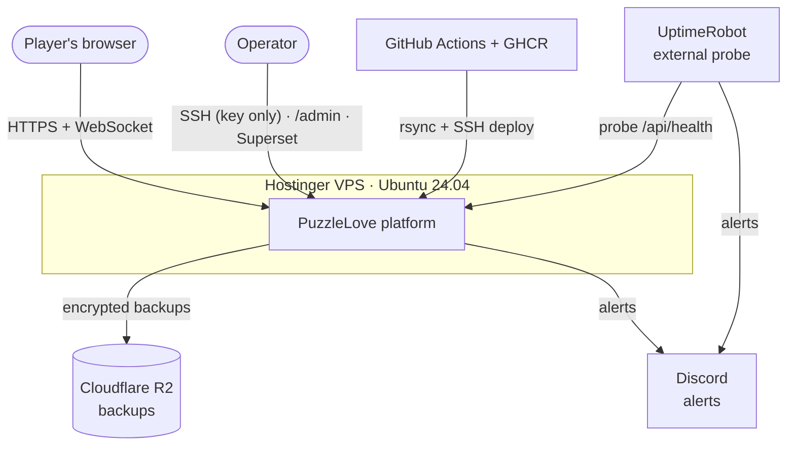
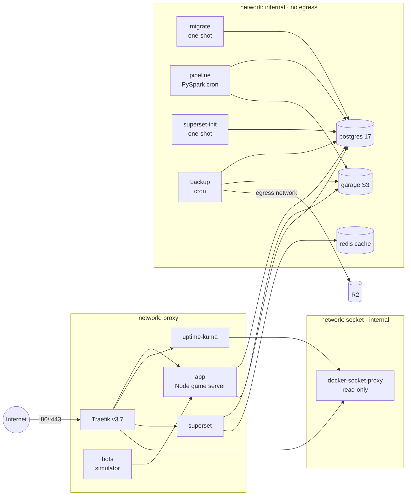
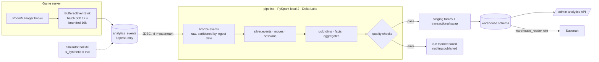
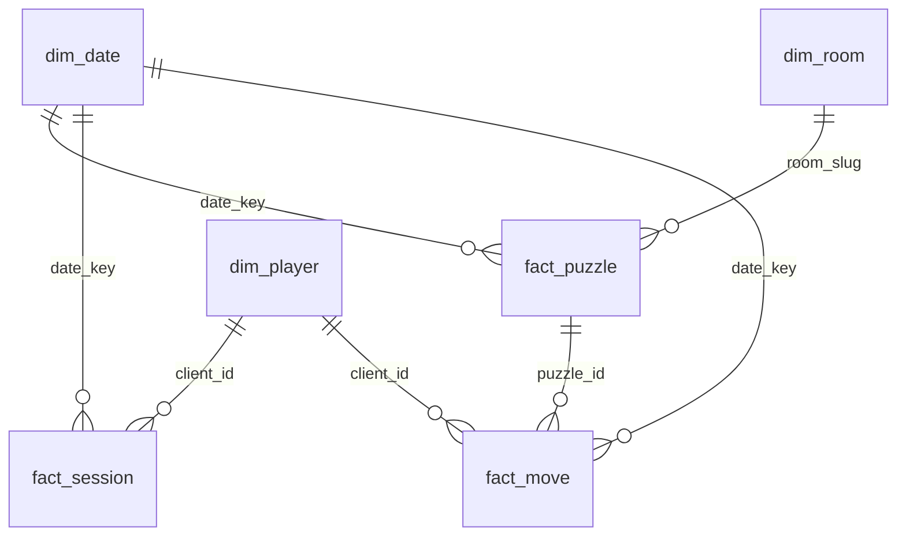
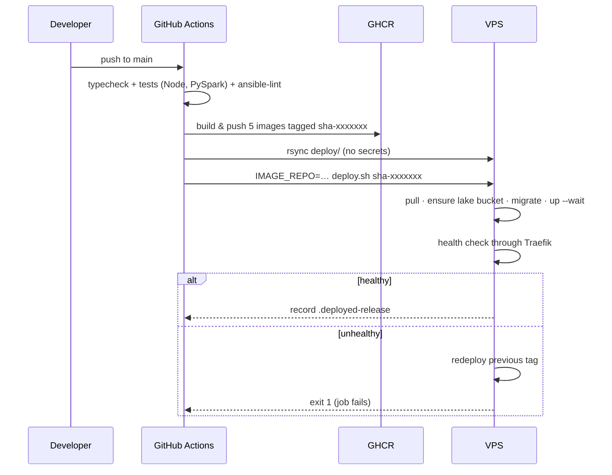

# PuzzleLove — Architecture

PuzzleLove is a real-time multiplayer jigsaw puzzle. Around the game sits a small but complete production platform:
hardened hosting, CI/CD, backups, monitoring, and a data stack that turns gameplay into analytics. Everything runs on
**one Hostinger VPS (Ubuntu 24.04, 8 GB RAM, 96 GB disk)** so the whole system can be operated by one person on a
personal budget.

This document describes the system as it is. The reasons behind each major choice are in [adr/](adr/), the story of
how it was built (including every incident) is in [journey.md](journey.md), and operating procedures are in
[runbook.md](runbook.md).

## 1. Context

## 2. Containers and networks

All services run under Docker Compose (`deploy/docker-compose.prod.yml`). Only Traefik publishes ports.

| Service | Image | Role | Memory limit |
|---|---|---|---|
| traefik | `traefik:v3.7` | TLS termination, routing by host, security headers, rate limit | 128 MB |
| socket-proxy | `tecnativa/docker-socket-proxy` | Read-only Docker API for Traefik and Uptime Kuma (POST is rejected) | 64 MB |
| app | `puzzlelove` | Game API, Socket.IO, static client, analytics sink | 400 MB |
| migrate | `puzzlelove-migrate` | `prisma migrate deploy` before every app start | — |
| postgres | `postgres:17` | Game state, analytics events, `warehouse` schema, Superset metadata | 1 GB |
| garage | `dxflrs/garage:v2.4.1` | S3 storage: `puzzlelove` (images) and `lake` (Delta tables) buckets | 256 MB |
| bots | `puzzlelove` | Live bots in the global room, scaled by an hourly curve | 128 MB |
| pipeline | `puzzlelove-pipeline` | Daily PySpark + Delta Lake run (supercronic) | 3 GB |
| redis | `redis:8.8-alpine` | Superset cache only (no persistence) | 128 MB |
| superset-init | `puzzlelove-superset` | Creates roles, admin and dashboards (idempotent) | — |
| superset | `puzzlelove-superset` | Analytics UI and public dashboard | 1.2 GB |
| uptime-kuma | `louislam/uptime-kuma:2.5.5-slim-rootless` | Internal monitoring and public status page | 256 MB |
| backup | `puzzlelove-backup` | Daily `pg_dump` + image archive, age-encrypted, to R2 | 256 MB |

Steady-state memory is roughly 1.5 GB; the pipeline adds up to ~2.5 GB for a few minutes at night.

### Hostnames

| Host | Target | Access |
|---|---|---|
| `luisjgl.cloud` | app | Public; `/admin` behind a password (signed, `Secure` cookie) |
| `superset.luisjgl.cloud` | superset | Public dashboard; everything else behind Superset login |
| `status.luisjgl.cloud` | uptime-kuma | Public status page; admin UI behind Traefik basic auth **and** Kuma login |
| `traefik.luisjgl.cloud` | Traefik dashboard | Basic auth |

## 3. The game server

- **Deterministic engine (`shared/`).** Piece shapes come from a seeded PRNG, so client and server compute identical
  geometry; only group offsets are sent over the network.
- **Authoritative rooms (`server/src/rooms/RoomManager.ts`).** The server owns locks (one group per player, 30 s
  timeout), batches movement broadcasts every 50 ms, decides snaps with `releaseGroup` and detects completion.
- **State lives in memory** and is persisted to Postgres every 5 s when dirty, on completion and on `SIGTERM`. This is
  why the game runs as a single instance (see [ADR-0003](adr/0003-single-game-instance.md)).
- **Global room:** everyone plays the same 5×5 puzzle; after completion the next queued image (or a reshuffle) starts.
  **Private rooms:** up to 8 players, deleted after 24 h of inactivity.

## 4. Data platform

### 4.1 Event tracking

`server/src/analytics/` records 12 event types from `RoomManager`: room and puzzle lifecycle, joins and leaves,
grabs, grab conflicts, drops, abandoned grabs (player left, regrabbed or lock timed out), completions, global
rotations and room expirations. Continuous drag movements are **not** tracked.

The sink never blocks or fails gameplay: events are buffered and inserted in batches with `createMany`
(`skipDuplicates`). If Postgres is unavailable, batches are retried, and past 10,000 events the oldest are dropped and
logged.

**`analytics_events`**

| Column | Type | Purpose |
|---|---|---|
| `id` | bigserial | Incremental extract watermark |
| `event_id` | uuid, unique | Idempotent inserts and downstream deduplication |
| `event_type`, `schema_version` | text, smallint | Event contract and its version |
| `occurred_at`, `ingested_at` | timestamptz | Event time and arrival time (lag is measurable) |
| `session_id`, `client_id` | text | Socket connection and pseudonymous browser identity |
| `room_slug`, `room_type`, `puzzle_id` | text | Room and one play-through (`slug:seed`) |
| `payload` | jsonb | Type-specific fields |
| `is_synthetic` | boolean | True for simulator backfill |

### 4.2 Traffic classes

Three populations share the table and stay separable end to end:

| Class | How it is identified | Where it comes from |
|---|---|---|
| Human | neither flag below | Real players |
| Bot | `client_id LIKE 'bot-%'`, names prefixed "🤖" | Live bots keeping the global room active |
| Synthetic | `is_synthetic = true` | Simulator backfill for demos and development |

Every silver row and gold fact carries `traffic_type`, and both dashboards filter on it.

### 4.3 Lake layers (Delta Lake in the `lake` bucket)

| Layer | Tables | Write strategy |
|---|---|---|
| bronze | `events` | Append per run, partitioned by `ingest_date`; rows above the watermark are deleted first so a retried run is idempotent |
| silver | `events` | Deduplicated by `event_id` with `MERGE`; local date/hour/weekday in America/Mexico_City |
| silver | `moves` | Each `piece_grabbed` paired with the next move event of the same session: dropped, abandoned or open |
| silver | `sessions` | Each `player_joined` paired with the next `player_left` in the same room, with move statistics |
| gold | `dim_date`, `dim_player`, `dim_room` | Full rebuild |
| gold | `fact_puzzle`, `fact_session`, `fact_move` | Full rebuild |
| gold | `agg_daily_activity`, `agg_daily_puzzles`, `agg_hourly_heatmap`, `agg_difficulty` | Full rebuild |

Silver-derived tables and gold are recomputed on every run. With about 600k events this takes about 100 seconds, which
is simpler and safer than incremental gold at this scale.

### 4.4 Warehouse (Postgres `warehouse` schema)

A star schema: facts keyed by `date_key` (yyyymmdd) with natural keys for players (`client_id`) and rooms
(`room_slug`). Gold tables are written over JDBC to `_stg_*` tables, then swapped in within a single transaction:
drop, rename, convert timestamps to `timestamptz`, add primary keys and indexes. Readers never see a half-loaded table.

### 4.5 Data quality

| Check | Severity |
|---|---|
| `event_id` unique in silver | error |
| Required fields present | error |
| No events more than 10 minutes in the future | error |
| Silver row count equals distinct bronze `event_id`s | error |
| `puzzle_id` unique in `fact_puzzle` | error |
| Row counts in the warehouse equal gold | error |
| Grabs left open in finished sessions ≤ 1% | warn |
| Completed puzzles with merges ≠ pieces − 1 ≤ 2% (a puzzle of N pieces needs exactly N−1 merges) | warn |

Any `error` failure stops the run before publishing, so dashboards keep yesterday's data. Every run is recorded in
`warehouse.pipeline_runs` with status, watermark, row counts, check results and the error.

### 4.6 Consumption

- **`/admin` → Analytics** (`GET /api/admin/analytics`, admin only): KPIs with period-over-period deltas, daily trends,
  a weekday × hour heatmap, completion by puzzle size, a table view and the last pipeline run. Ranges end at the last
  **complete** day.
- **Superset** connects as `warehouse_reader`, a Postgres role that can only `SELECT` from `warehouse`, with default
  privileges so recreated tables stay readable and with no access to `pipeline_runs`. The public dashboard uses four
  virtual datasets containing **aggregates only**: no player names or ids. It is created from
  `deploy/superset/bootstrap/dashboards.py` on every deploy.

## 5. Delivery

- The five images share one tag: `puzzlelove`, `puzzlelove-migrate`, `puzzlelove-backup`, `puzzlelove-pipeline` and
  `puzzlelove-superset`.
- Migrations are forward-only, so they must be backward compatible with the previous release; rollback only swaps
  images.
- A deploy can be rehearsed on Docker Desktop with the same script: `COMPOSE_EXTRA=docker-compose.local.yml`.

## 6. Security

| Layer | Controls |
|---|---|
| Host | SSH keys only, no root login, `AllowUsers luis`, `MaxAuthTries 3`; fail2ban; unattended security upgrades; all managed by Ansible |
| Network | Hostinger panel firewall + UFW (22 rate-limited, 80, 443). Docker bypasses UFW, so **no container except Traefik publishes ports**, and databases sit on an `internal` network with no egress |
| Edge | Let's Encrypt certificates, HTTP→HTTPS redirect, HSTS, `nosniff`, `X-Frame-Options: DENY`, referrer and permissions policies, TLS ≥ 1.2, per-IP rate limit |
| Docker API | Traefik and Uptime Kuma reach Docker only through a read-only socket proxy (writes return 403) |
| Secrets | Only in `/opt/puzzlelove/.env` (mode 600) and GitHub environment secrets. Deploy uses a dedicated SSH key and a pinned `known_hosts`. rsync excludes `.env` |
| Data access | Separate Garage keys for images and lake; read-only `warehouse_reader` role; public dashboards expose aggregates only |
| Backups | Encrypted with an age public key on the server. The private key never lives on the server; it is piped over SSH only for restores |

## 7. Operations

- **Backups:** daily at 03:30 Mexico City, `pg_dump -Fc` plus a tar of the image bucket, age-encrypted, uploaded to
  R2, 30-day retention. `restore.sh test` restores the latest backup into a throwaway Postgres inside the container and
  reports row counts; it was run successfully against production. The lake is not backed up because it can be rebuilt
  with `--full-refresh`.
- **Monitoring:** Uptime Kuma checks the app internally and publicly (including certificate expiry), Postgres,
  Garage, containers, and a push heartbeat from the backup job. UptimeRobot probes from outside so a dead VPS still
  alerts. All alerts go to Discord.
- **Provisioning:** `deploy/ansible` has 8 roles (base, users, ssh, firewall, fail2ban, swap, docker, app). Tested
  twice in a systemd container (second run `changed=0`) and applied to production with a `--check --diff` review first.

## 8. Known limitations

- **Single node, no high availability.** A VPS failure means downtime until it is rebuilt with Ansible and restored
  from R2. Recovery time depends on the operator.
- **One game instance.** Rooms live in memory; horizontal scaling would need a Socket.IO adapter and room ownership.
- **Spark in local mode.** The pipeline uses Spark's APIs and Delta Lake, but not a cluster. The data volume does not
  justify one, and 8 GB could not host it.
- **Batch, not streaming.** Dashboards lag by up to a day by design.
- **Brief unavailability during deploys.** Recreated containers (game, Superset) are unreachable for a few seconds;
  the public dashboard answered 404 for a short moment while Superset restarted during a deploy.
- **Synthetic data in production.** A 14-day simulated history was loaded for demonstration. It is flagged, filterable
  and removable (`backfill --purge` + `pipeline run --full-refresh`).
- **Superset UI language.** The official 6.1 image ships without compiled Spanish translations, so parts of the UI are
  in English.
